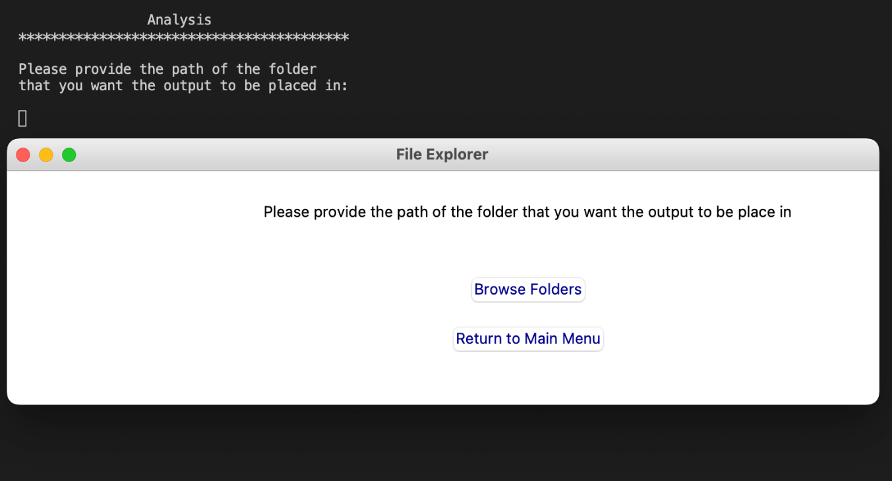
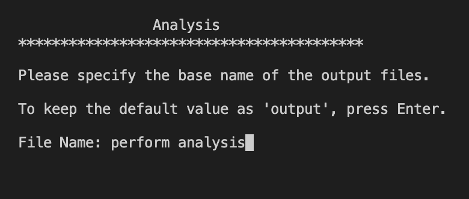
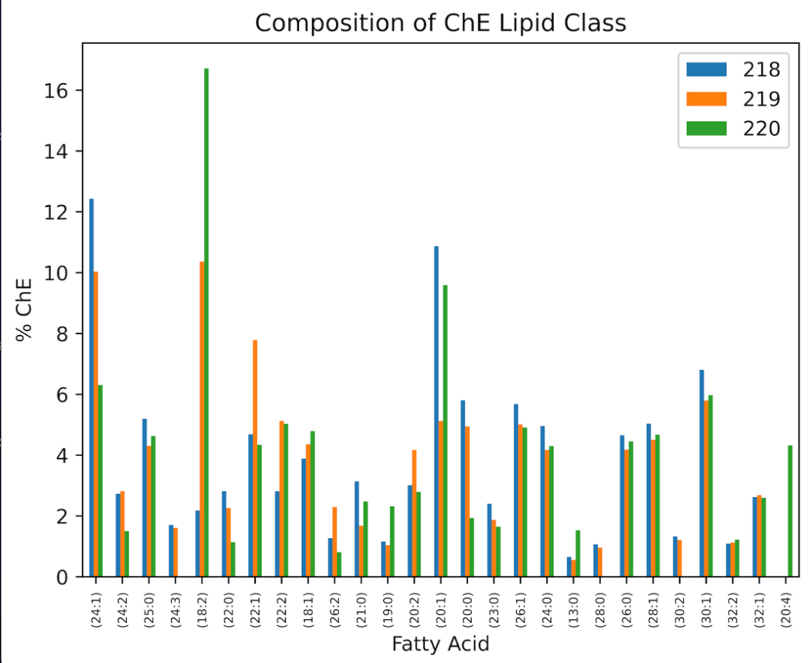

# 
 Lipidomics-Analyser-Host

## Product Information

The Lipidomics Analyser program accepts the output of Thermo Fisher Scientific&#39;s LipidSearch Software as input to analyse the lipid composition of a sample. The program contains the following options:

#### Option 1: Perform Analysis

This functionality performs the following:

- Selects specific information from the output of Thermo Fisher Scientific&#39;s LipidSearch Software
- Determines the internal standard of a particular lipid
- Determines the relative amount of each lipid to internal standard of that same class
- Notifies the user of any ambiguous data points for manual correction

#### Option 2: Visualise Data

This functionality performs the following:

- Visualisation of analysed data by lipids within a class.
- Visualisation of analysed data in totality as lipid classes.

#### Option 3: Configuration

This functionality performs the following:

- Displays the list of current internal standards and relative information, including the concentration and Mz value, and the chosen abbreviated term for each lipid class
- Adds and removes internal standards from the list of internal standards
- Displays the current minimum and maximum thresholds for the Mz values
- Alters the minimum and maximum thresholds for the Mz values

The Lipidomics Analyser program and documentation were developed by Liam Druckman ([z5309229@unsw.edu.au](mailto:z5309229@unsw.edu.au)), Gabrielle Younes ([z5256995@unsw.edu.au)](mailto:z5256995@unsw.edu.au)and Vinay Swamy ([z5216639@unsw.edu.au](mailto:z5216639@unsw.edu.au)). Documentation is up to date as of 02/08/2022.

#

# **System Requirements**

As of August 2022, the minimum system requirements are as follows:

|   |   |  |
| --- | --- | --- |
| Requires macOS 10.15 or later | Requires Windows 10.0 or later | Requires Ubuntu 20.04 LTS |

# **Input &amp; Output**

| **Functionality** | **Input Required** | **Output Expected** |
| --- | --- | --- |
| Opening the program | None | The first time that the program is run, a file called &quot;config.json&quot; is created, which stores the default configuration settings of the app.     When the settings are changed in the program, this file is updated accordingly. As such, this file needs to be in the same directory as the program for the configurations to remain.     Otherwise, the program will simply generate a new default file to use, and previous changes will not be seen. This also means that if you want to save previous configurations you can make a copy of this file to store. |
| Perform Analysis | Output of Thermo Fisher LipidSearch software.     It is expected that both a positive and negative mode file will be supplied. If one is not present, simply create a blank file in the same format as the one that exists (including headers) but no data. | output.csv (default name) containing analysis results pertaining to the concentration of all the lipids within the sample.     The columns of the output are the following: <ul><li>**Sample:** the number of the Sample, as identified in the input file name.</li><li>**LipidIon:** the identified lipid.</li><li> **Class:** the class of the identified lipid. </li><li>**FattyAcid:** the fatty acid attached to the lipid functional groups. </li><li>**Ion:** the ions attached to the molecule from the mass spectrometry analysis. </li><li>**Formula:** the chemical formula of the lipid.</li> <li>**ObsMz:** the Mz ratio measured from the deflection in the mass spectrometry.</li> <li>**Pol:** whether the mass spectrometry was run in positive or negative mode when collecting the sample. </li><li>**ObsMass:** the measured mass of the lipid.</li> <li>**CalcMz:** the expected Mz ratio based on the chemical formula. </li><li>**m-Score:** the m-score measures the fit between experimental and expected product ion spectra and is based on the number of matching fragments. </li><li>**t-Score:** the number of standard deviations from the mean of the experimental results </li><li>**Grade:** the quality of the match of the lipid. A is the highest match which becomes sequentially worse.</li> <li>**Area:** the calculated expression of the lipid in the sample. Proportional to the concentration of the lipid for a given reading.</li> <li>**IsStandard:** true if the lipid is an internal standard, otherwise false. </li><li>**Ratio:** the area of the lipid divided by the area of the relevant internal standard.</li> <li>**Conc. (pM):** the concentration of the lipid in the sample, given in pM. </li></ul>|
| Perform Analysis | Output of Thermo Fisher LipidSearch software.     It is expected that both a positive and negative mode file will be supplied. If one is not present, simply create a blank file in the same format as the one that exists (including headers) but no data.| total\_output.csv (default name) containing analysis results pertaining to the percentage composition of the lipid sample by lipid class.   The columns of the output are the following:<ul><li>**Sample:** the number of the Sample, as identified in the input file name.</li><li>**Class:** the lipid class for which the numbers are relevant.</li><li>**Sum (pM):** the total concentration of lipids of that class in the sample.</li><li>**% of Lipid Class in Overall Sample:** the percentage of the sample that is made up by this lipid class.</li></ul>|
| Perform Analysis | | &quot;log.txt&quot; is a text file that contains information about specific decisions made by the program whilst analysis occurs. The file is generated during the performing analysis stage and is outputted alongside the annotated data.    The below errors will be flagged in the log file:<ul><li>No internal standard for the lipid class: [Lipid Class] has been found. Using an average of other lipid concentrations instead.</li><li>The lipid class [Lipid Class] is included in the configuration file, however, no lipid ion of this class has been found in the sample file.</li><li>The observed Mz value of the lipid class: [Lipid Class] lies outside of the threshold internal standard range. Using an average of other lipid concentrations instead.</li><li>The average Area value used for the lipid class: [Lipid Class] is [Area]. The average Concentration value used for the lipid class: [Lipid Class] is [Concentration].</li><li> No internal standard found for [Lipid]. Given the presence of D5TG, the area and concentration values for TG will be calculated using D5TG.</li><li> The [Lipid] had a Mz Ratio of [Mz-value out of range]. </li><li> No internal standard found for [Lipid Class]. No fatty acid matches the internal standard with an Mz ratio within the bounds. Using an average of other lipid concentrations instead.</li></ul> The file stores other information as well such as if an internal standard couldn&#39;t be identified and what was used in its stead. |
| Visualise Data | Output.csv | Visualisations of concentration of all the lipids within the sample in .png format. The axis of the visualised output are the following:<ul><li>**x-axis:** fatty acid.</li><li>**y-axis:** percentage of fatty acids within a given lipid class.</li><li>**Legend** : sample number.</li></ul> |
|  Visualise Data | Total\_output.csv | Visualisation of percentage compositions of lipid sample by lipid class in .png format. The axis of the visualised output are the following:<ul><li>**x-axis:** lipid class.</li><li>**y-axis:** percentage of total lipid composition.</li><li>**Legend:** sample number.</li></ul> |

## **Set Up**

The Lipidomics Analyser program can be downloaded from the [GitHub link](https://github.com/LiamDruckman/Lipidomics-Analyser-Host).

To download the executable from the repository, follow the steps outline below.

1. Open the link in your chosen browser.

_Figure 1: GitHub repository_

2. Press the green code button, to open the panel shown below and press the &#39;Download Zip&#39; button.

_Figure 2: Download file from GitHub repository_

3. Open the ZIP file from your Downloads folder and extract the files to your preferred location. To then run the program, simply click on the executable file named &#39;lipidomics\_analyser.exe&#39; if you are using Windows or &#39;lipidomics\_analyser&#39; on Linux.

## **Configurations**

#### Viewing Internal Standards

To view the list of internal standards, follow the steps outlined below.  

1. To view the list of all configurations, type &quot; **3&quot;** and press enter/return from the &quot; **Main Menu&quot;** page.

_Figure 3: Main Menu_

2. To view the list of internal standards, type **&quot;1&quot;** and press the enter/return key from **&quot;Configurations Menu&quot;**.

_Figure 4: Configurations Menu_

3. The current list of internal standards can be viewed as shown below, including their Mz Ratios, their concentrations in the sample (measured in pM), and the class that they act as the internal standard for.

_Figure 5: List of all internal standards_

#### Removing Internal Standards

1. To view the list of all configurations, type &quot; **3&quot;** and press enter/return from the &quot; **Main Menu&quot;** page _(refer to Figure 3)._

2. To remove an internal standard, type **&quot;2&quot;** and press enter/return from the **&quot;Configurations Menu&quot;** _(refer to Figure 4)._

3. Select an internal standard to remove. In this example, we type **&quot;13&quot;** and press enter/return to remove Ceramide.

_Figure 6: Removing internal standard_

4. Confirm your selection of the internal standard to remove. Type &quot; **1&quot;** and press enter/return to **&quot;Continue&quot;.** You will then be directed to the **&quot;Configurations Menu&quot;** _(refer to Figure 4)._

_Figure 7: Confirming removal of internal standard_

5. To view the list of internal standards, type **&quot;1&quot;** and press the enter/return key from the **&quot;Configurations Menu&quot;** _(refer to Figure 4)._

6. Upon viewing the list of current internal standards, you will notice thatCeramide is not present in the list as it has been removed.

_Figure 8: List of all internal standards after removal of Ceramide (Cer)_

#### Adding Internal Standards

1. To view the list of all configurations, type &quot; **3&quot;** and press enter/return from the &quot; **Main Menu&quot;** page _(refer to Figure 3)._

2. To add an internal standard, type &quot; **3&quot;** and press enter/return from the **&quot;Configurations Menu&quot;** _(refer to Figure 4)._

3. Type the name of the lipid that you wish to add. Make sure that you include the fatty acid at the end of the name (e.g. &quot;17:0&quot;). Once done, press enter/return.

_Figure 9: Entering name of lipid_

4. Type the Mz Ratio of the lipid that you wish to add. Once done, press enter/return.

_Figure 10: Entering Mz of lipid_

5. Type the concentration of the lipid in the sample (in pM). Once done, press enter/return.

_Figure 11: Entering concentration of lipid_

6. Type the class of the lipid to be added as a new internal standard. Once done, press enter/return.

 The class of the internal standard must correspond to the class in the LipidSearch program. (i.e. Cer for ceramides, ChE for cholesterols etc).

_Figure 12: Entering class of lipid_

7. Confirm your selection of internal standards to add. Type &quot; **1&quot;** and press enter/return to **&quot;Continue&quot;.** You will then be directed to the **&quot;Configurations Menu&quot;** _(refer to Figure 4)._

_Figure 13: Confirming addition of internal standard_

8. To view the list of internal standards, type **&quot;1&quot;** and press the enter/return key from **&quot;Configurations Menu&quot;** _(refer to Figure 4)._

9. Upon viewing the list of current internal standards, you will notice thatCer has now been added to the list of internal standards.

_Figure 14: List of all internal standards_

#### Change Minimum &amp; Maximum Mz Values

1. To view the list of all configurations, type &quot; **3&quot;** and press enter/return from the &quot; **Main Menu&quot;** page _(refer to Figure 3)._

2. To change the minimum and maximum threshold Mz values (at which an error will be flagged if a Mz value lies outside of this range), type &quot; **5&quot;** and press enter/return from the **&quot;Configurations Menu&quot;** _(refer to Figure 4)._

3. Enter the minimum Mz value and press enter/return. In this example, we set the minimum Mz to be 201.

_Figure 15: Entering new minimum Mz value_

4. Enter the maximum Mz value press enter/return. In this example, we set the maximum Mz to be 1999.

_Figure 16: Entering new maximum Mz value_

5. Confirm your change of minimum and maximum Mz values. Type &quot; **1&quot;** and press enter/return to **&quot;Continue&quot;.** You will then be directed to the **&quot;Configurations Menu&quot;** _(refer to Figure 4)._

_Figure 17:Confirming change of minimum and maximum Mz_

#### Viewing Minimum &amp; Maximum Mz Values

1. To view the list of all configurations, type &quot; **3&quot;** and press enter/return from the &quot; **Main Menu&quot;** page _(refer to Figure 3)._

2. To view the minimum and maximum threshold Mz values (where a Mz value outside of this range will flag an error), type &quot; **4&quot;** and press enter/return from the **&quot;Configurations Menu&quot;** _(refer to Figure 4)._

3. Since we set the minimum Mz to be 201 and the maximum Mz to be 1999 in the example above, this is reflected in the current max and min values.

_Figure 18: View minimum and maximum Mz values_

## **Perform Analysis**

1. To commence analysis of the LipidSearch output files, type **&quot;1&quot;** and press the enter/return key from **&quot;Main Menu&quot;** _(refer to Figure 3)._

2. Select **&quot;Browse Folders&quot;.** By selecting **&quot;Return to Main Menu&quot;** , the program will return you back to the **&quot;Main Menu&quot;** screen _(refer to Figure 3)._

_Figure 19: Interface to select &quot;Browse Folder&quot; for input_

3. Select a folder that contains all the datasets that are to be analysed. Please ensure that only the LipidSearch output files are in the folder you select. In this example, we are selecting the &quot;data&quot; folder containing the LipidSearch output.

Only folders can be selected, not individual files

_Figure 20: Native interface to select folder_

4. Select **&quot;Browse Folders&quot;.** By selecting **&quot;Return to Main Menu&quot;** , the program will return you back to the **&quot;Main Menu&quot;** _(refer to Figure 3)._

_Figure 21: Interface to select &quot;Browse Folder&quot; for output_

5. Select the folder in which you would like to save the output. In this example, output is saved in &quot;Perform Analysis Output&quot; folder.

_Figure 22: Interface to select folder to store analysis output_

6. If you would like to save the output with any specific name, type it below. Otherwise, press enter to save the file with the default name of &quot;output&quot;. In this example, we enter &quot;perform analysis&quot;.

_Figure 23: Specifying base name of output_

7. Verify the input and output folders, type **&quot;1&quot;** and press the enter/return keyto continue if input, output folders and output file name is correct. Otherwise, type **&quot;2&quot;** and press the enter/return keyto return to the **&quot;Main Menu&quot;** _(refer to Figure 3),_ without performing analysis.

_Figure 24: Confirming input and output folder_

8. Allow up to 30 seconds for the analysis to occur.

_Figure 25: Performing Analysis_

9. At this stage the analysis is complete.

_Figure 26: Analysis complete_

As shown below, you should now see two files in the selected output folder, which in this example is &quot;Perform Analysis Output&quot;: &quot;perform analysis.csv&quot; and &quot;total\_perform analysis.csv&quot;.

_Figure 27: Output from Perform Analysis_

## **Visualise Data**

To perform data visualisation, it is best practice to use the files obtained from the Perform Analysis stage, i.e., &quot;total\_output.csv&quot; and/or &quot;output.csv&quot; (referencing the default names).

#### Visualising the composition of a sample(s) by lipid class (total\_output.csv)

1. To visualise the analysed samples, type **&quot;1&quot;** and press the enter/return key from **&quot;Main Menu&quot;** _(refer to Figure 3)._

2. Select **&quot;Browse Files&quot;.** By selecting **&quot;Return to Main Menu&quot;** , the program will return you back to the **&quot;Main Menu&quot;** _(refer to Figure 3)._

_Figure 28: Interface to select &quot;Browse Files&quot; for input_

3. Select the file from your file directory that contains the output from the Perform Analysis stage. In this example, we are selecting the file &quot;total\_perform analysis.csv&quot;which is taken from the &quot;Perform Analysis Output&quot;folder.If the default names are kept, use the &quot;total\_output.csv&quot; file.

_Figure 29: Selecting &quot;total\_perform analysis.csv&quot; as input_

4. Select &quot; **Browse Folders&quot;** to choose the output folder where the visualisation files will be saved.

_Figure 30: Interface to select &quot;Browse Folders&quot; for output_

5. From the folder directory, select your chosen folder to store the visualised outputs. In this example, the &quot;Data Visualisation Output&quot;folder will be used.

_Figure 31: Interface to select folder for visualisation output_

6. As mentioned above in the Input &amp; Output section, &quot;total\_output.csv&quot; (or &quot;total\_perform analysis.csv&quot; in this example) contains the analysis results pertaining to the percentage composition of the lipid sample, by lipid class. Hence, strictly select option **&quot;2&quot;.**

_Figure 32: Selecting whole lipid classes_

7. Select the samples that you wish to visualise as a comma separated list, as shown below, and press enter/return.

_Figure 33: Selecting samples to visualise_

8. If there are any lipid classes that you wish to exclude, enter it as shown below. Otherwise, if you wish to include all classes, do not enter a lipid class, and press the enter/return key.

_Figure 33: Excluding lipid classes_

9. Ensure that your selected samples, lipid classes and input and output folders, are correct, by reviewing the information presented. Enter **&quot;1&quot;** to continue. If you would like to change your options, type **&quot;**** 2&quot; **to return to the**&quot;Main Menu&quot;** _(refer to Figure 3)_ and start the process again.

_Figure 34: Confirming input, output folder_

10. Allow up to 30 seconds for the visualisation to be completed.

_Figure 35: The loading screen for visualisation_

11. At this stage the analysis is complete.

_Figure 36: The success for a completed visualisation_

12. Once the visualisation is complete, you should now see an image in .png format in the selected output folder.

_Figure 37: Folder containing visual output_

13. The chosen lipid classes will be shown in the image file that is produced. Given that the lipid classes Cer, ChE and LPE were excluded in this example, these will not be presented in the visualisation, as shown in _Figure 38._

_Figure 38: Visualisation output for lipids within a class_

#### Visualising composition of a lipid class across sample (output.csv)

1. To commence the visualisation of the analysed samples, type &quot; **2&quot;** and press enter/return from the &quot; **Main Menu&quot;** page _(refer to Figure 3)._

2. Select **&quot;Browse Files&quot;** _(refer to Figure 28)._By selecting **&quot;Return to Main Menu&quot;** , the program will return you back to the **&quot;Main Menu&quot;** page _(refer to Figure 3)._

3. Select the file from your file directory that contains the output from the Perform Analysis stage. In this example, we are selecting the file **&quot;** perform analysis.csv&quot; which is taken from &quot;Perform Analysis Output&quot;folder. If the default names are kept, use the &quot;output.csv&quot; file.

_Figure 39: Selecting perform analysis file_

4. Select &quot; **Browse Folders&quot;** to choose the output folder where the visualisation files will be saved _(refer to Figure 30)._

5. Select the folder that you would like to save the output in. In this example, the output is once again saved in &quot;Data Visualisation Output&quot; folder _(refer to Figure 31)._

6. As explained in the &quot;Input &amp; Output&quot; section above, &quot;output.csv&quot; contains the analysis results pertaining to the percentage composition of the lipid sample, by lipid class. In this example, the corresponding output file is named &quot;perform analysis.csv&quot;. Hence, strictly select option **&quot;1&quot;**.

_Figure 40: Selecting individual lipids_

7. Select lipid classes by entering a numerical value. In this example, we are visualising ChE, hence **&quot;2&quot;** is typed and the return/enter key pressed to continue to the next step.

_Figure 41: Selecting lipid to visualise_

8. Select the samples that you wish to visualise. In this example, we are visualising sample 218, 219, and 220 as shown below.

_Figure 42: Selecting sample/s to visualise_

9. Ensure that the selected sample, classes and input and output folders are correct, by reviewing the presented information. Enter **&quot;1&quot;** to continue. If you choose to change the configurations, enter &quot; **2**&quot;to return to the **&quot;Main Menu&quot;** page _(refer to Figure 3)_ and start the process again.

_Figure 43: Confirming input, output folder_

10. Once visualisation is complete, an image in .png format will appear in the selected output folder.

_Figure 44: Folder containing visual output_

11. The chosen lipid classes will be shown in the image file that is produced. Given that the lipid class ChE was selected in this example, this will be presented in the visualisation, as shown in _Figure 45__._

_Figure 45: Visualisation output for composition of lipid class_
